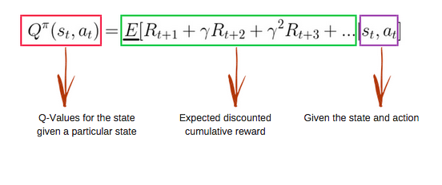
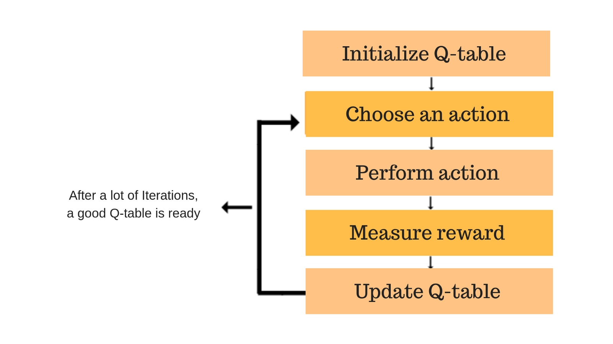

# FlappyBird-DQN


# What is Q-Learning?
Q-learning is a values-based learning algorithm in reinforcement learning. In this article, we learn about Q-Learning and its details:
```
1	What is Q-Learning ?
2	Mathematics behind Q-Learning
3	Implementation using python
```
Q-learning is a model-free reinforcement learning algorithm. The goal of Q-learning is to learn a policy, which tells an agent what action to take under what circumstances. It does not require a model (hence the connotation "model-free") of the environment, and it can handle problems with stochastic transitions and rewards, without requiring adaptations.

## Mathematics: the Q-Learning algorithm
### Q-function
The Q-function uses the Bellman equation and takes two inputs: state (s) and action (a).
 
There is an iterative process of updating the values. As we start to explore the environment, the Q-function gives us better and better approximations by continuously updating the Q-values in the table.
Now, let’s understand how the updating takes place.

### Introducing the Q-learning algorithm process
 


# Deep Q-learning
The DeepMind system used a deep convolutional neural network, with layers of tiled convolutional filters to mimic the effects of receptive fields. Reinforcement learning is unstable or divergent when a nonlinear function approximator such as a neural network is used to represent Q. This instability comes from the correlations present in the sequence of observations, the fact that small updates to Q may significantly change the policy and the data distribution, and the correlations between Q and the target values. 
The technique used experience replay, a biologically inspired mechanism that uses a random sample of prior actions instead of the most recent action to proceed. This removes correlations in the observation sequence and smooths changes in the data distribution. Iterative update adjusts Q towards target values that are only periodically updated, further reducing correlations with the target
They demonstrated how a computer learned to play Atari 2600 video games by observing just the screen pixels and receiving a reward when the game score increased. The result was remarkable because it demonstrates the algorithm is generic enough to play various games.
Game:

## The code simply does the following:
```
1.	The code receives the Game Screen Input in the form of a pixel array
2.	The code does some image pre-processing
3.	The processed image will be fed into a neural network (Convolution Neural Network), and the network will then decide the best action to execute (Flap or Not Flap)
4.	The network will be trained millions of times, via an algorithm called Q-learning, to maximize the future expected reward.
```


# Training the model:
To train the network from beginning, delete the model.h5 and run ``` qlearn.py -m "Train" ```

# Running the model:

**CPU only**

```
git clone https://github.com/kkarthick12/FlappyBird-DQN.git
cd FlappyBird-DQN
python qlearn.py -m "Run"
```

**GPU version (Theano)**

```
git clone https://github.com/kkarthick12/FlappyBird-DQN.git
cd FlappyBird-DQN
THEANO_FLAGS=device=gpu,floatX=float32,lib.cnmem=0.2 python qlearn.py -m "Run"
```

